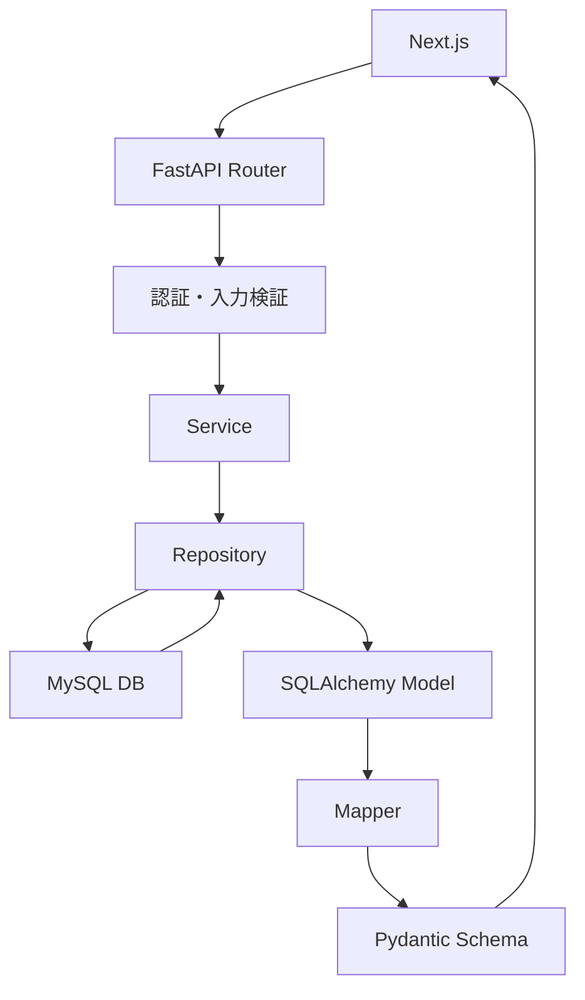

# バックエンドの仕様書

## API構成

- POST /api/auth/login
  - ログインの情報送信

- GET /api/users/me
  - ログインしたユーザの情報を取得

- GET /api/users/{user_id}/groups
  - ユーザの担当しているグループ一覧を取得

- GET /api/users/{user_id}/groups/{group_id}/tasks
  - 各グループ内のタスクを表示

- PATCH /api/tasks/{task_id}/state
  - タスクの状態変更

- POST /api/tasks/{task_id}/comments
  - コメント投稿

- GET /api/tasks/{task_id}/comments
  - 各タスクのコメント一覧取得

## APIのデータ構成

- POST /api/auth/login
  - リクエスト想定
    ```json
    {
        "user_name": "takahashi",
        "password": "test1"
    }
    ```

  - 成功レスポンス
    ```json
    {
        "user": {
            "user_id": 1,
            "user_name": "takahashi",
            "role_name": "worker"
        }
    }
    ```

  - ステータス
    - 200: ログイン成功
    - 401: ユーザ名またはパスワード不正

- /api/users/me
  - 成功レスポンス
    ```json
    {
        "user_id": 1,
        "user_name": "takahashi",
        "role_id": 1,
        "role_name": "worker",
        "login_at": "2026-09-30T07:30:00Z"
    }
    ```

- /api/users/{user_id}/groups
  - 各グループの進捗情報を表示するために，担当グループと状態毎の件数を返す

  - 自分のuser_idの情報のみを取得

  - 管理者はすべてのユーザの進捗を閲覧可能

  - 成功レスポンス
    ```json
    {
        "user": {
            "user_id": 1,
            "user_name": "takahashi"
        },
        "groups": [
            {
                "group_id": 1,
                "group_name": "グループ1",
                "image_id_min": 1,
                "image_id_max": 1000,
                "total_count": 1000,
                "state_counts": [
                    {
                        "state_id": 1,
                        "state_name": "未着手",
                        "count": 500
                    },
                    {
                        "state_id": 2,
                        "state_name": "完了",
                        "count": 400
                    },
                    {
                        "state_id": 3,
                        "state_name": "付与予定ラベル",
                        "count": 80
                    },
                    {
                        "state_id": 4,
                        "state_name": "コメント",
                        "count": 20
                    }
                ]
            }
        ]
    }
    ```

- /api/users/{user_id}/groups/{group_id}/tasks
  - ページネーション
    - ?state_id=1: 状態でフィルタをかける場合に使用
    - &page=1: 1以上
    - &page_size=100: 10, 50, 100を選択可能

  - 成功レスポンス
    ```json
    {
        "group": {
            "group_id": 1,
            "group_name": "グループ1",
            "user_id": 1,
            "user_name": "takahashi"
        },
        "tasks": [
            {
                "task_id": 1,
                "image_id": 1,
                "state_id": 1,
                "state_name": "未着手",
                "updated_at": "2026-09-30T07:30:00Z"
            },
            {
                "task_id": 2,
                "image_id": 2,
                "state_id": 2,
                "state_name": "完了",
                "updated_at": "2026-09-30T07:32:00Z"
            },
        ],
        "pagination": {
            "page": 1,
            "page_size": 100,
            "total": 1000,
            "total_pages": 10
        }
    }
    ```

- PATCH /api/tasks/{task_id}/state
  - リクエスト想定
    ```json
    {
        "state_id": 2
    }
    ```

  - 成功レスポンス
    ```json
    {
        "task_id": 1,
        "group_id": 1,
        "image_id": 1,
        "state_id": 2,
        "state_name": "完了",
        "updated_at": "2026-09-30T07:35:00Z"
    }
    ```

  - 処理の流れ
    1. ログイン状態を確認
    2. タスクを取得(deleted_at IS NULL)
    3. ログインユーザが担当グループに該当しているかを確認
    4. state_idの存在確認
    5. tasks.state_idを更新
    6. 更新日時を更新
    7. 更新後のタスクを返す

  - ステータス
    - 200: 更新成功
    - 401: 未認証
    - 403: 担当外のタスク
    - 404: タスクまたは状態が存在しない
    - 422: state_idの形式が不正

- POST /api/tasks/{task_id}/comments
  - リクエスト想定
    ```json
    {
        "content": "付与予定ラベル: tuna",
        "parent_id": null
    }
    ```

  - 成功レスポンス
    ```json
    {
        "comment_id": 1,
        "task_id": 1,
        "user_id": 1,
        "user_name": "takahashi",
        "parent_id": null,
        "content": "付与予定ラベル: tuna",
        "created_at": "2026-09-30T07:30:00Z"
    }
    ```

  - ステータス
    - 201: コメント作成成功
    - 401: 未認証
    - 403: コメント投稿権限なし
    - 404: タスクまたは親コメントが存在しない
    - 422: コメント本文が空、長すぎる、形式不正

- GET /api/tasks/{task_id}/comments
  - 成功レスポンス
    ```json
    {
        "task_id": 1,
        "comments": [
            {
            "comment_id": 1,
            "user_id": 1,
            "user_name": "takahashi",
            "parent_id": null,
            "content": "付与予定ラベル: tuna",
            "created_at": "2026-09-30T07:30:00Z",
            "updated_at": "2026-09-30T07:30:00Z"
            }
        ],
        "pagination": {
            "page": 1,
            "page_size": 50,
            "total": 1,
            "total_pages": 1
        }
    }
    ```

## エラーレスポンス

- レスポンス
    ```json
    {
    "error": {
        "code": "TASK_NOT_FOUND",
        "message": "指定されたタスクが存在しません"
    }
    }
    ```

| code | HTTP | 意味 |
|---|---:|---|
| `VALIDATION_ERROR` | `422` | 入力値不正 |
| `AUTHENTICATION_REQUIRED` | `401` | 未認証・認証期限切れ |
| `INVALID_CREDENTIALS` | `401` | ログイン失敗 |
| `PERMISSION_DENIED` | `403` | 権限不足 |
| `USER_NOT_FOUND` | `404` | ユーザーなし |
| `GROUP_NOT_FOUND` | `404` | グループなし |
| `TASK_NOT_FOUND` | `404` | タスクなし |
| `STATE_NOT_FOUND` | `404` | 状態なし |
| `COMMENT_NOT_FOUND` | `404` | コメントなし |
| `INTERNAL_SERVER_ERROR` | `500` | サーバー内部エラー |

## 権限仕様

| API | 作業者 | 管理者 |
|---|---|---|
| `GET /users/me` | 自分のみ | 自分のみ |
| `GET /users/{id}/groups` | 自分のみ | 全員 |
| `GET /users/{id}/groups/{group_id}/tasks` | 担当グループのみ | 全グループ |
| `PATCH /tasks/{task_id}/state` | 担当タスクのみ | 全タスク |
| `POST /tasks/{task_id}/comments` | 担当タスクのみ | 全タスク |
| `GET /tasks/{task_id}/comments` | 担当タスクのみ | 全タスク |

## データの流れ

