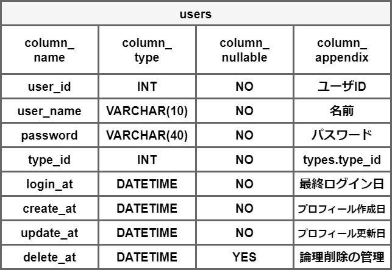
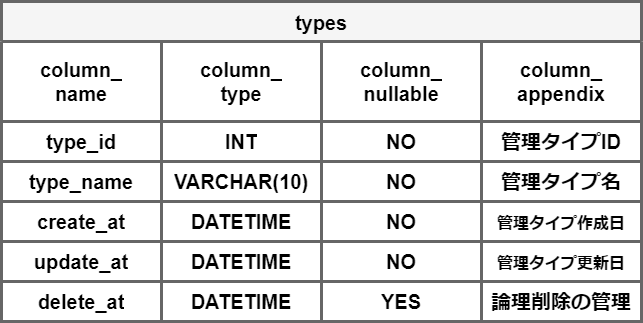
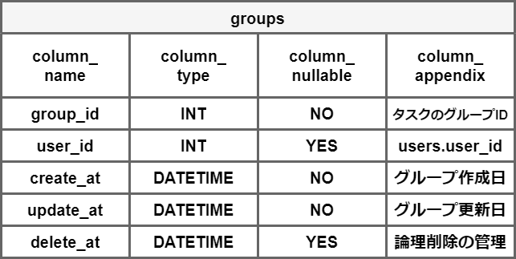
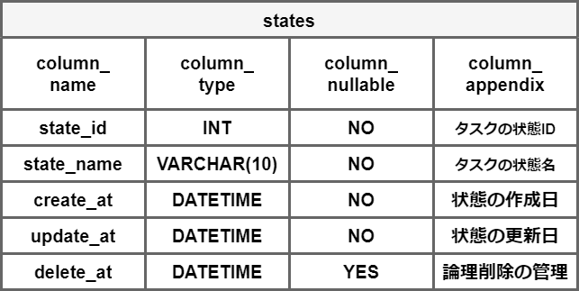
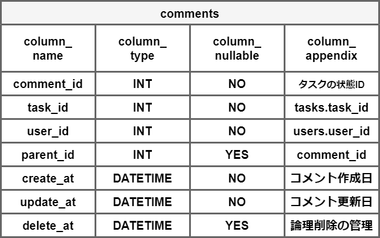
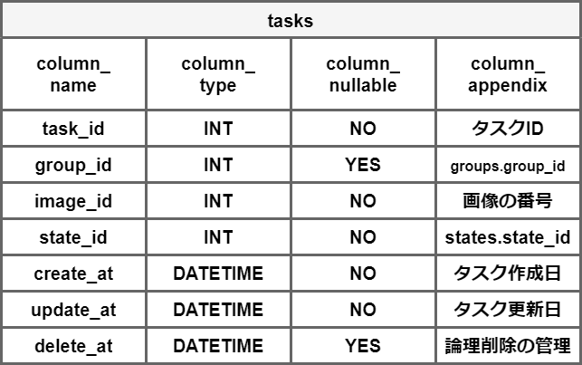
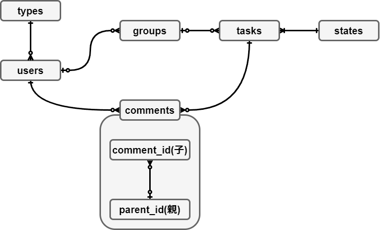

# データベースの仕様書

## 使用するテーブル

以下の六つのテーブルを使用する．

- users
  - ユーザ情報を管理するテーブル
  - 管理者用のアカウントと作業作用のアカウントで権限を分ける

  

- types
  - ユーザの管理タイプを定義するテーブル
  - 作業者と管理者を管理タイプとして定義

  

- groups
  - タスクのグループを管理するテーブル
  - 各グループの担当者を決めるときに使用する

  

- states
  - タスクの状態を管理するテーブル
  - 未着手，完了，付与予定ラベル，コメントの四つを想定

  

- comments
  - タスクに対するコメントを管理するテーブル
  - 付与予定ラベルとコメントの状態の場合に投稿されるコメントデータを管理するテーブル

  

- tasks
  - タスクを管理するテーブル
  - アノテーションをする画像がimage_idとなっており，番号に対応させて状態の更新を行う

  

## ER図

上記の六つのテーブルに対するER図を示す．

