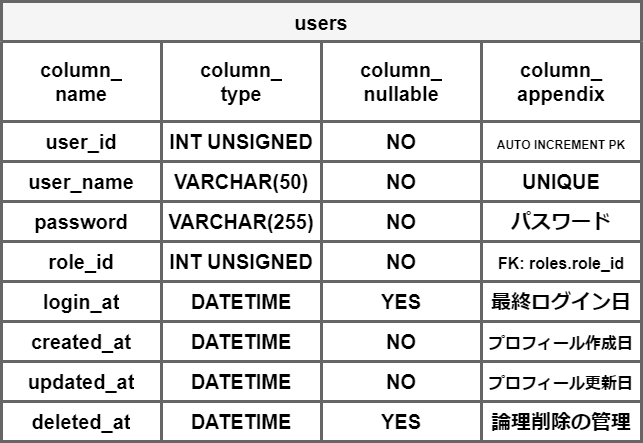
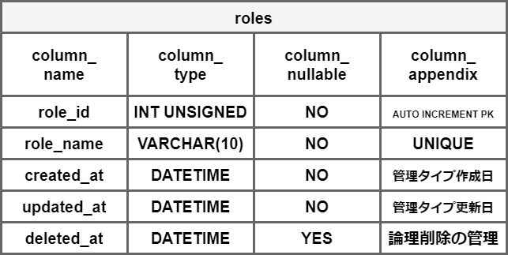
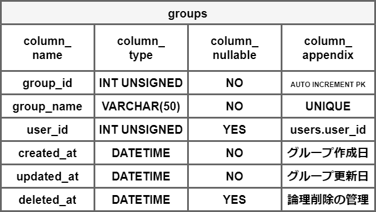
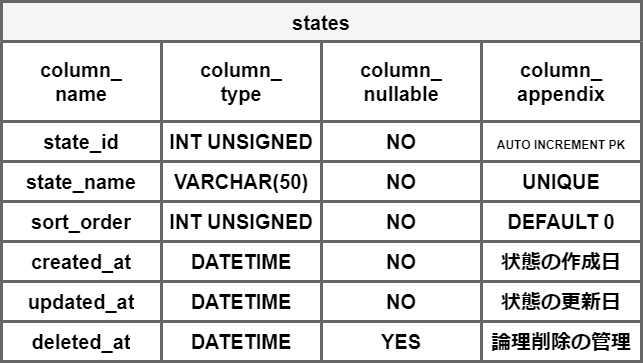
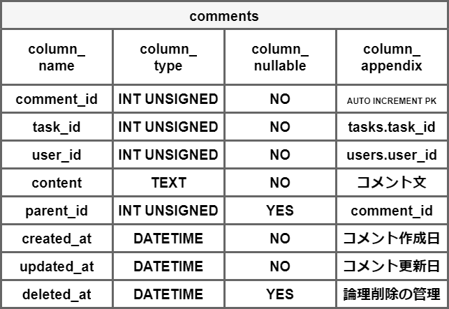
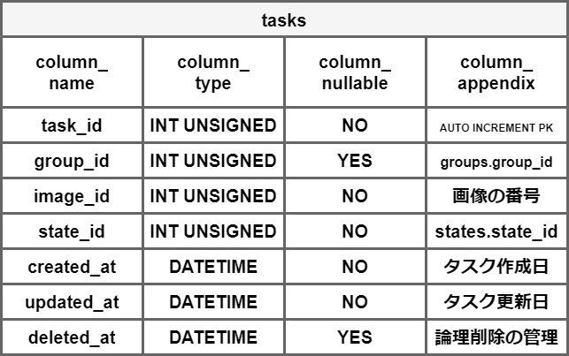
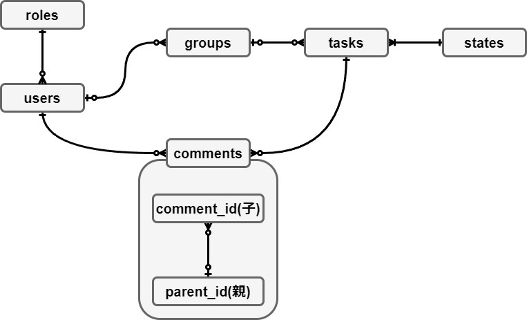

# データベースの仕様書

## 使用するテーブル

以下の六つのテーブルを使用する．

- users
  - ユーザ情報を管理するテーブル
  - 管理者用のアカウントと作業作用のアカウントで権限を分ける

  ```txt
  users.role_id → roles.role_id
  ON UPDATE CASCADE
  ON DELETE RESTRICT
  ```

  

- roles
  - ユーザの管理タイプを定義するテーブル
  - 作業者と管理者を管理タイプとして定義

  

- groups
  - タスクのグループを管理するテーブル
  - 各グループの担当者を決めるときに使用する

  ```txt
  groups.user_id → users.user_id
  ON UPDATE CASCADE
  ON DELETE SET NULL
  ```

  

- states
  - タスクの状態を管理するテーブル
  - 未着手，完了，付与予定ラベル，コメントの四つを想定

  

- comments
  - タスクに対するコメントを管理するテーブル
  - 付与予定ラベルとコメントの状態の場合に投稿されるコメントデータを管理するテーブル

  ```txt
  comments.task_id → tasks.task_id
  ON UPDATE CASCADE
  ON DELETE RESTRICT

  comments.user_id → users.user_id
  ON UPDATE CASCADE
  ON DELETE RESTRICT

  comments.parent_id → comments.comment_id
  ON UPDATE CASCADE
  ON DELETE SET NULL
  ```

  

- tasks
  - タスクを管理するテーブル
  - アノテーションをする画像がimage_idとなっており，番号に対応させて状態の更新を行う

  ```txt
  tasks.group_id → groups.group_id
  ON UPDATE CASCADE
  ON DELETE SET NULL

  tasks.state_id → states.state_id
  ON UPDATE CASCADE
  ON DELETE RESTRICT
  ```

  

## ER図

上記の六つのテーブルに対するER図を示す．



## インデックス

```txt
roles(role_name)                  UNIQUE
users(user_name)                  UNIQUE
groups(group_name)                UNIQUE
states(state_name)                UNIQUE

groups(user_id)
tasks(group_id)
tasks(state_id)
tasks(group_id, state_id)
# tasks(image_id)                 UNIQUE -> 画像の番号がユニーク
                                            であるかは要確認
comments(task_id)
comments(user_id)
comments(parent_id)
comments(task_id, created_at)
```
