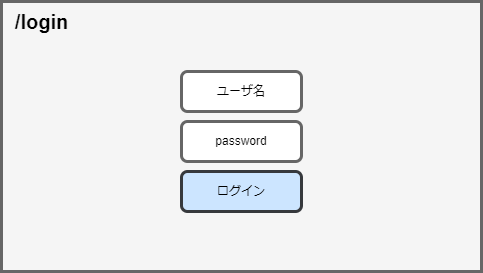
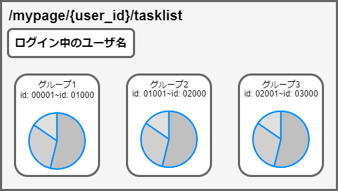
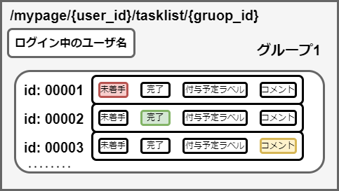

# フロントエンドの仕様書

## 最小構成

「/check_annotator/」以降のパスに各ページを作成する．

- 必要なページ
  - アプリ使用者向けページ
    - /login -> ログイン用のページ
    - /mypage/{user_id}/tasklist -> 各ユーザのタスク一覧を表示するページ
    - /mypage/{user_id}/tasklist/{group_id} -> 各ユーザのタスク一覧から，各グループのタスクの詳細を表示するページ
  - 管理者用ページ
    - /admin -> 管理者用のメインページ
    - admin/dashboard -> 進捗を表示するダッシュボード用のページ
    - admin/{user_id}/tasklist -> 各ユーザのタスクの進捗を表示するページ

## 各ページのイメージ図

- /login

- /mypage/{user_id}/tasklist

- /mypage/{user_id}/tasklist/{group_id}

- /admin

- admin/dashboard

- admin/{user_id}/tasklist

## 今後の追加要素

現在は具体的な使用は決まっていないので，後ほど決定

- 追加リスト
  - コメント送信用のページ
  - コメント返信用のページ
