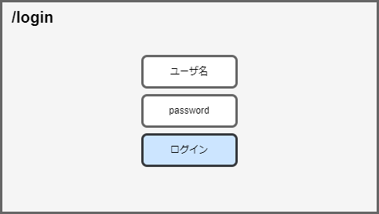
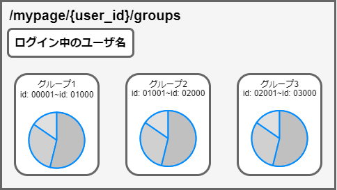
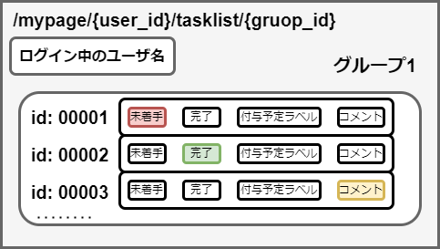

# フロントエンド仕様書

## 1. 目的と対象範囲

本フロントエンドは、アノテーション作業者が担当グループの進捗、タスク状態、コメントを管理するためのWeb画面を提供する。

初期リリースでは、実装済みバックエンドAPIで完結する作業者向け機能を対象とする。管理者向け画面は画面構成のみ定義し、ユーザー一覧などの不足APIが追加された後に実装する。

## 2. 技術構成

- フレームワーク: Next.js（App Router）
- 言語: TypeScript
- UI: React
- バックエンド: FastAPI
- 認証: `access_token` Cookie
- API接続: Next.jsの同一オリジン `/api/*` をFastAPIの `/api/*` へ中継する

## 3. URL構成

公開時のベースパスは `/check_annotator` とする。

| パス | 対象 | 内容 | 初期リリース |
| --- | --- | --- | --- |
| `/check_annotator/login` | 共通 | ログイン | 対象 |
| `/check_annotator/mypage/{user_id}/groups` | 作業者・管理者 | ユーザーの担当グループと進捗 | 対象 |
| `/check_annotator/mypage/{user_id}/groups/{group_id}` | 作業者・管理者 | グループ内のタスク、状態、コメント | 対象 |
| `/check_annotator/admin` | 管理者 | 管理メニュー | API追加後 |
| `/check_annotator/admin/dashboard` | 管理者 | 全体進捗 | API追加後 |
| `/check_annotator/admin/{user_id}/groups` | 管理者 | 指定ユーザーの進捗 | API追加後 |

存在しないパスは404画面を表示する。

## 4. 認証と画面遷移

### 4.1 ログイン

1. ユーザー名とパスワードを入力する。
2. `POST /api/auth/login` を呼び出す。
3. 成功時、レスポンスの `user_id` と `role_name` を参照する。
4. 作業者は `/check_annotator/mypage/{user_id}/groups` へ遷移する。
5. 管理者も初期リリースでは同じグループ画面へ遷移する。管理画面実装後は `/check_annotator/admin` へ変更する。

ログイン失敗時は「ユーザー名またはパスワードが正しくありません」をフォーム上部へ表示し、パスワードのみ消去する。

### 4.2 認証確認

ログイン以外の画面を表示するときは `GET /api/users/me` で認証状態を確認する。

- 401の場合: ログイン画面へ遷移する。
- 作業者がURL上の別ユーザーIDを指定した場合: 自分のグループ画面へ戻す。
- 管理者: 他ユーザーのグループ画面を参照できる。

### 4.3 ログアウト

ヘッダーのログアウトボタンから `POST /api/auth/logout` を呼び出し、成功後にログイン画面へ遷移する。

## 5. API通信共通仕様

- ブラウザーからは必ず `/api` で始まる同一オリジンURLを使用する。
- Next.jsは `/api/:path*` をバックエンドの `/api/:path*` へ中継する。
- Cookieを送信するため、別オリジンへ直接接続する場合は `credentials: "include"` を指定する。
- JSON送信時は `Content-Type: application/json` を指定する。
- 成功レスポンスはバックエンド仕様書の型をそのまま使用し、フロントエンド独自の `id` や `title` へ読み替えない。
- APIエラーは `error.message` を利用者向けメッセージとして表示する。
- 通信中の操作は二重送信を防ぐため無効化する。

### 5.1 HTTPステータス別の扱い

| HTTP | 画面の扱い |
| ---: | --- |
| 401 | 認証情報を破棄したものとしてログイン画面へ遷移 |
| 403 | 「アクセス権限がありません」を表示 |
| 404 | 対象が存在しない旨を表示し、直前の一覧へ戻る導線を表示 |
| 422 | 入力欄付近に入力エラーを表示 |
| 500 | 再試行可能な共通エラーを表示 |

## 6. 画面仕様

### 6.1 ログイン画面

#### 表示項目

- ユーザー名入力欄
- パスワード入力欄
- ログインボタン
- エラーメッセージ領域

#### 入力規則

- ユーザー名: 必須、1〜50文字
- パスワード: 必須、1〜255文字
- 前後空白を自動除去しない。入力値をそのままバックエンドへ送信する。

### 6.2 担当グループ一覧画面

#### 使用API

- `GET /api/users/me`
- `GET /api/users/{user_id}/groups`
- `POST /api/auth/logout`

#### 表示項目

- ログインユーザー名
- 各グループの名称
- 画像IDの開始値と終了値
- 総タスク数
- 状態別件数と進捗率
- グループ詳細へのリンク

進捗率は `完了件数 / total_count × 100` とする。`total_count` が0の場合は0%と表示する。

グループが0件の場合は「担当グループはありません」と表示する。

### 6.3 グループ詳細画面

#### 使用API

- `GET /api/users/{user_id}/groups`
- `GET /api/users/{user_id}/groups/{group_id}/tasks`
- `PATCH /api/tasks/{task_id}/state`
- `GET /api/tasks/{task_id}/comments`
- `POST /api/tasks/{task_id}/comments`

#### タスク一覧

- 画像ID
- 現在の状態
- 最終更新日時
- コメント表示ボタン
- 状態変更操作

初期表示は `page=1&page_size=50` とする。状態フィルターは `state_id` を使用し、切り替え時にページを1へ戻す。ページサイズは10、50、100から選択する。

並び順はバックエンドの返却順を維持する。タスクが0件の場合は「該当するタスクはありません」と表示する。

#### 状態変更

状態候補は `GET /api/users/{user_id}/groups` の `state_counts` に含まれる `state_id` と `state_name` を使用する。

1. 状態を選択する。
2. `PATCH /api/tasks/{task_id}/state` を呼び出す。
3. 成功時、対象行の状態名と更新日時をレスポンス値で置き換える。
4. 失敗時は元の表示を維持し、エラーを表示する。

#### コメント表示

コメントは選択したタスクの行下部または詳細領域へ表示する。独立したコメントページは初期リリースでは作成しない。

- 初期表示: `page=1&page_size=50`
- 並び順: 作成日時、コメントIDの昇順
- 表示項目: 投稿者名、本文、作成日時、更新日時、返信元
- 0件の場合: 「コメントはありません」
- 論理削除済みコメント: 表示しない

#### コメント投稿・返信

- 本文: 前後空白除去後1〜2000文字
- 通常投稿: `parent_id` を `null` とする。
- 返信: 返信対象の `comment_id` を `parent_id` とする。
- 成功時: 返却されたコメントを一覧へ追加し、入力欄を空にする。
- 失敗時: 入力内容を保持してエラーを表示する。

## 7. API対応表

| 画面・操作 | HTTP | API |
| --- | --- | --- |
| ログイン | POST | `/api/auth/login` |
| ログアウト | POST | `/api/auth/logout` |
| 認証確認 | GET | `/api/users/me` |
| グループ進捗表示 | GET | `/api/users/{user_id}/groups` |
| タスク一覧・状態絞り込み | GET | `/api/users/{user_id}/groups/{group_id}/tasks` |
| タスク状態変更 | PATCH | `/api/tasks/{task_id}/state` |
| コメント一覧 | GET | `/api/tasks/{task_id}/comments` |
| コメント投稿・返信 | POST | `/api/tasks/{task_id}/comments` |

## 8. 共通表示仕様

### 8.1 日時

APIのUTC日時をブラウザーのローカル時刻へ変換し、`YYYY/MM/DD HH:mm` 形式で表示する。

### 8.2 ローディング

- 初回読込: ページ構造を維持するスケルトンまたは「読み込み中」を表示する。
- 更新処理: 操作対象のみ無効化し、ページ全体を操作不能にしない。

### 8.3 空表示

0件はエラーとして扱わず、対象ごとの空メッセージを表示する。

### 8.4 アクセシビリティ

- 入力欄にはラベルを関連付ける。
- キーボードのみで操作できるようにする。
- 状態を色だけで表現せず、状態名を併記する。
- APIエラーは画面上で読み取れるテキストとして表示する。

## 9. 管理画面の保留事項

管理画面を実装するには、少なくとも次のバックエンドAPI仕様を追加する必要がある。

- ユーザー一覧取得
- 全グループまたは全体進捗取得
- 必要に応じたユーザー・グループ管理

APIが定義されるまでは、管理者も既知の `user_id` に対する作業者向け画面を利用する。

## 10. 受入条件

- ログインから担当グループ一覧へ遷移できる。
- 未認証時に保護画面を表示しない。
- グループ別の状態件数と進捗率を確認できる。
- タスク一覧を状態で絞り込み、ページ移動できる。
- タスク状態を変更し、成功結果を画面へ反映できる。
- コメントの一覧、投稿、返信ができる。
- 401、403、404、422、500を仕様どおり表示できる。
- Cookie付きでバックエンドAPIを呼び出せる。
- ローディング、0件、通信失敗の各状態を表示できる。

## 11. 今後の追加候補

- 管理者ダッシュボード
- ユーザー、グループの登録・編集・削除
- コメント編集・削除
- 通知機能
- HTTPS導入後の認証強化
